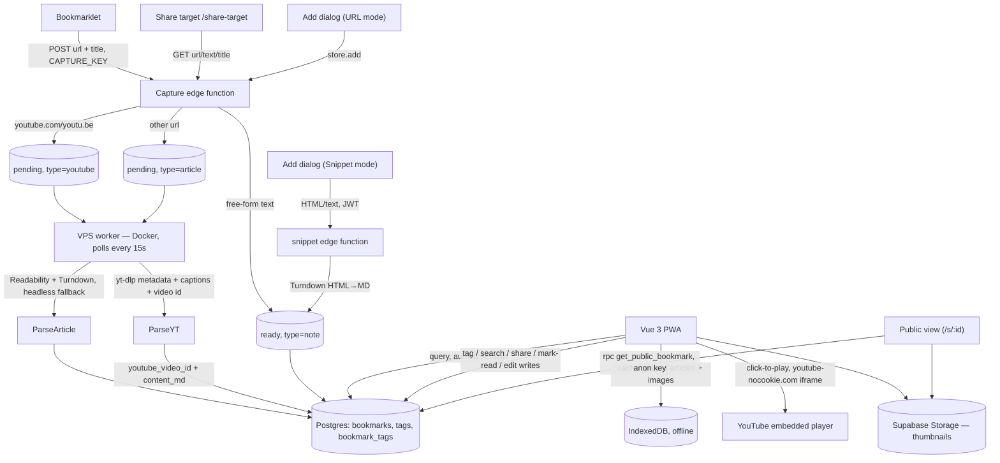

# Read Later — YouTube embed & editing

Next concrete step, narrowed down from the broader capabilities pass: **in-reader YouTube playback via embedded player**, and **inline editing** for notes/snippets and parsed articles. Both are self-contained — no new secrets, no new third-party API integration, no changes to the capture paths themselves.

AI-summarized Instagram capture and Twitter/X capture (bookmarklet DOM-scrape, or simply pasting into the existing Snippet mode with an added optional URL field) are deferred, not dropped — see the closing note.

Grounded against `docs/architecture.md`: the `bookmarks` schema (§2), the worker's poll-and-parse loop (§4), the reader/editor surface (§6), and architecture.md §9's already-flagged note-editing gap.

---

## 0. Pre-existing state that affects this plan

- **`parseYoutube.ts` already calls yt-dlp's `--dump-json` metadata endpoint**, but today `ytDlpRunner.ts` only reads `title`/`uploader`/`thumbnail`/`duration` off that response and drops the `id` field — it isn't captured anywhere yet. §1 below adds that one field to the existing call (no new network request) rather than re-deriving an id from the bookmark's stored `url` client-side, which would need to handle `youtu.be`, `youtube.com/watch?v=`, `/shorts/`, and share-link tracking params (`si=`) all separately, and get it wrong silently if a format changes.
- **YouTube video playback stays online-only** — embedding YouTube's own player needs a live connection to `youtube.com` regardless of what's cached locally. This doesn't change the existing offline story (transcript + thumbnail already cache via IndexedDB); "offline" was never really on the table for the video itself, so there's no tension with the offline design to resolve.
- **Architecture.md §9 already flags note editing as a known gap** — this doc closes it, rather than treating it as a fresh discovery.
- **Notes never enter the `pending` queue** (they're written `status = 'ready'` directly at insert) — relevant to §2.2 below, since it means the worker-overwrite conflict only applies to `article`/`youtube` rows, not notes/snippets.
- **`content_md` is real markdown, not plain prose** — Readability+Turndown for articles, Turndown for HTML snippets (`2026-07-26-snippet-capture-design.md`). Editing it as raw source text is a worse experience than the app's actual formatting deserves, which is why §2 below reaches for a small editor library rather than a bare `<textarea>` — the first genuine frontend dependency the project has taken on, a deliberate departure from architecture.md §6's "no component library, vanilla CSS" posture, worth naming as a precedent rather than sliding past quietly.

---

## 1. YouTube playback via embedded player

Today's YouTube pipeline (`parseYoutube.ts`) fetches metadata + auto-captions only, and the reader shows a static thumbnail + transcript. This adds an actual playable embed in the reader — no video bytes ever touch the app or its storage, just metadata (as already fetched) plus YouTube's own iframe player.

### 1.1 Video id — resolved server-side, not parsed from the URL client-side

yt-dlp's `--dump-json` output (already fetched by `ytDlpRunner.ts`'s `fetchMeta`) includes an `id` field alongside the `title`/`uploader`/`thumbnail`/`duration` fields already read today — it just isn't picked off the response yet. Add it to `YtDlpMeta`/`fetchMeta` and store it, rather than re-deriving an id from `bookmarks.url` in the frontend: a share-link URL can arrive as `youtu.be/<id>`, `youtube.com/watch?v=<id>`, `youtube.com/shorts/<id>`, or a mobile share link with a `si=` tracking param — regex-parsing all of those client-side duplicates logic the worker can resolve correctly once from a call it already makes, and a URL-format edge case would fail silently in the UI instead of loudly in one place. (Confirming the response really does name the field `id` on the installed yt-dlp version is a §6 checklist item, not assumed here.)

```sql
alter table bookmarks add column youtube_video_id text;
```

`parseYoutube.ts` sets it from yt-dlp's `id` field at the same time it writes `content_md`/`thumbnail_url` — no extra network call, the metadata fetch already returns it.

### 1.2 Reader UI

- `ArticleContent.vue` today is fully type-agnostic: it takes a single `contentMd` prop and pipes it through `markdown-it` → `DOMPurify` → `v-html`, with no awareness of bookmark `type` at all. The "thumbnail" for a YouTube bookmark is just a `` markdown image baked into `content_md` by the worker — there's no dedicated `` element or YouTube-specific branch to swap today. This adds one: thread `type` and `youtube_video_id` into the component (or a thin wrapper around it) for the first time, and render a click-to-play affordance above the existing markdown content for `type === 'youtube'` — thumbnail shown first (as today), tapping it swaps in an `<iframe>` pointed at `https://www.youtube-nocookie.com/embed/${youtube_video_id}`. Embedding on open rather than gating behind a tap would fire a request to YouTube every time the reader opens, even for someone just skimming the transcript — click-to-play keeps that opt-in, and the `-nocookie` domain avoids setting third-party cookies until playback is actually chosen.
- Transcript stays exactly as it is today, rendered below the player — it's still the thing that's searchable (`search_vector`) and readable offline; the embed is additive, not a replacement.
- No new icon needed in `BookmarkRow.vue`/`ReaderHeader.vue` beyond the existing YouTube type icon — this isn't a new action to trigger, just a richer reader view for a type that already exists.

### 1.3 Older bookmarks

Rows captured before this ships have `youtube_video_id = null`. Either is fine at personal-library scale: leave the player hidden for those (falls back to today's thumbnail-only view) until re-parsed, or a one-off backfill script re-deriving the id from `url` for existing rows using the same logic the worker applies going forward. Left open — see §5.

---

## 2. Editing snippets & articles

Closes the item architecture.md §9 already flags: notes (including pasted snippets) and parsed articles have no in-app edit path today — any fix means editing the Postgres row by hand.

### 2.1 Editor UI

- **New dependency: `md-editor-v3`** (MIT, Vue 3–native, zero runtime deps of its own, ~similar install footprint to a mid-sized UI component). Split-screen source + live-preview editing with a markdown-aware toolbar (bold/italic/link/list/heading buttons insert the right syntax rather than requiring it to be typed by hand), which is the actual gap the plain-textarea version left open — content is real markdown, and editing it blind was the problem.
- New pencil icon in `ReaderMenu.vue`'s existing overflow menu, alongside open-original / mark-read / share / archive / delete / font-size — available for every type (`article`, `youtube`, `note`), since all of them are just `title` + `content_md` underneath.
- Editing swaps `ArticleContent.vue`'s rendered `v-html` view for `<MdEditor v-model="draft" />` bound to a local copy of `content_md`. Title keeps its own small plain input above it — no need for the markdown editor there. Toolbar trimmed to what a personal typo-fixing tool actually needs (bold, italic, link, list, heading, undo/redo) — the library's fuller toolbar includes image upload, tables, Mermaid, KaTeX, none of which this app has a use for and which would just be visual noise the editor doesn't otherwise have.
- **Two integration seams worth being upfront about, not fully resolved here:**
  - *Theming.* `md-editor-v3` ships its own default light/dark styling, separate from the app's `--rl-*` custom-property system (`stores/theme.ts`). Binding its theme prop to the same `data-theme` state the rest of the app already tracks gets it *switching* correctly; making its palette actually *match* the app's Braun-inspired tokens is more work and isn't scoped here — acceptable for a v1 where the editor is a distinct modal-like surface, not the main reading UI.
  - *Two markdown renderers.* The reader still renders saved content through the existing `markdown-it` → `DOMPurify` → `v-html` pipeline (unchanged, still the actual security boundary — sanitization happens at render time regardless of what wrote the content). But `md-editor-v3`'s live preview uses its own bundled renderer, not the app's. The two aren't guaranteed to render every markdown construct identically, so what's shown while editing and what's shown after saving could diverge on edge cases. Worth a quick spot-check during implementation rather than assumed away.
- **Mobile**: split-screen (source + preview side by side) doesn't fit a narrow phone viewport — needs to collapse to a single-pane edit/preview toggle below some breakpoint. Not a big lift, but a real requirement given this is a mobile-first PWA, not a detail to discover late.
- Save recomputes `word_count`/`reading_time` client-side from the new text (`Math.max(1, Math.round(wordCount / 200))`, the same formula `worker/src/reading.ts` already uses) and writes `{ title, content_md, word_count, reading_time }` through the normal authed Supabase client — the same shape of write the PWA already does for `setPublic()` and tag updates, no new edge function.
- The saved-content security boundary is unchanged (see the "two markdown renderers" point above — `markdown-it` → `DOMPurify` → `v-html` still runs at render time regardless of what wrote `content_md`). What *is* new: unlike a bare textarea, `md-editor-v3`'s live preview actually renders the draft to HTML client-side, using its own renderer, before anything is saved. Worth confirming at implementation time that it escapes/strips raw HTML in the source rather than passing it through unsanitized — low stakes here since this only ever renders the single user's own authored content back to themselves (RLS-scoped, no multi-user exposure), but it's genuinely new rendering surface that a plain textarea never had, not a null risk to wave past.

### 2.2 Conflict with re-parse / refresh

`article`/`youtube` rows can be reset to `pending` two existing ways — the failed-article "Try again" button, and the duplicate-refresh flow (`POST /capture/:id/refresh`) — both of which let the worker overwrite `content_md` wholesale. A hand-edited row hitting either path would lose the edit silently.

Add `content_edited boolean not null default false`, set `true` on save from the new editor. Both refresh paths check it first: if `content_edited = true`, show a confirm step ("this was manually edited — refreshing will overwrite your changes") instead of clobbering silently. Reset to `false` once a confirmed refresh completes. Notes/snippets never enter `pending` in the first place (§0), so the flag is a no-op for them in practice — it only matters for the two types with a worker-owned refetch path.

### 2.3 Offline editing

Out of scope for v1 — writes need a live session, and editing offline would need a local queue-and-replay mechanism the app doesn't have for *any* write today (tags and mark-read are online-only too). See §5.

---

## 3. Updated architecture diagram



## 4. Schema summary (suggested migrations, in order)

- `20260727000001_youtube_video_id.sql` — add `youtube_video_id text`.
- `20260727000002_content_edited.sql` — add `content_edited boolean not null default false`.

Two separate, independently-revertable migrations — neither feature depends on the other shipping.

## 5. Open questions / follow-ups

- **Backfilling `youtube_video_id` for existing rows** (§1.3) — leave old rows without a player until re-parsed, or run a one-off backfill. Low-stakes either way; not decided here.
- **Offline editing** (§2.3) — not solved in v1; would need the same local queue-and-replay mechanism every other write is missing today, not something specific to editing. Worth revisiting only if that becomes a broader priority, not in isolation for this feature.
- **`md-editor-v3` theming depth** (§2.1) — theme-switching wired up, but full visual match to the `--rl-*` tokens is left for later. Fine as long as the editor reads as "a distinct edit mode," worth revisiting if it ends up feeling jarringly off-brand in practice.
- **Preview/render fidelity** (§2.1) — no specific markdown construct is known to diverge between `md-editor-v3`'s preview and the app's own `markdown-it` pipeline; flagged as a spot-check for implementation, not a known bug.

## 6. Implementation checklist — verify while building, not just designed around

Items flagged above as "worth confirming" rather than fully resolved. Not deferred like §5 — these need an actual answer during the build, just not one this doc commits to in advance.

**YouTube embed**
- [ ] Confirm yt-dlp's metadata response actually exposes the field this doc assumes is called `id` — check the installed yt-dlp version's real JSON output before wiring `parseYoutube.ts`, don't take the field name on faith. *(Not verified — no yt-dlp install available in this environment; `ytDlpRunner.ts` now reads `json.id` on the assumption it matches yt-dlp's documented `--dump-json` schema. Verify against the actual deployed worker before relying on it.)*
- [x] Thread bookmark `type`/`youtube_video_id` into `ArticleContent.vue` (or a wrapper) for the first time — it's currently type-agnostic with no per-type branch to extend, so this is new plumbing, not a swap of existing logic.
- [ ] Confirm `youtube-nocookie.com/embed/<id>` is still the correct embed URL shape at implementation time. *(Used as documented; not independently re-verified against current YouTube embed docs.)*
- [x] Verify the `<iframe>` isn't mounted in the DOM at all until the thumbnail is tapped (not just visually hidden) — confirmed via `v-if="playing"` and a test asserting no `<iframe>` exists pre-tap.

**Editing (`md-editor-v3`)**
- [x] Verify the library's default preview renderer escapes/strips raw HTML embedded in markdown source — tested with a `<script>`/`` payload: **it does not escape by default** — the raw `` tag was found unescaped in the rendered preview DOM. Fixed by wiring the library's `sanitize` prop to the app's existing `DOMPurify` instance (the same one used for the reader's own render pipeline); a regression test confirms the wired sanitizer strips `onerror`/`<script`.
- [x] Explicitly trim the `toolbars` prop to bold/italic/link/list/heading/undo-redo — done (`title, bold, italic, unorderedList, orderedList, link, revoke, next`; note the library's real toolbar-name keys are camelCase — `unorderedList`/`orderedList`, not kebab-case — caught by `vue-tsc`, not by guessing).
- [x] Bind the editor's theme prop to the app's existing `theme` store / `data-theme` attribute — bound directly to `useThemeStore().theme`, which is already the same `'light' | 'dark'` union the store uses.
- [x] Handle the narrow-viewport case: collapse split-screen to a single-pane edit/preview toggle below some breakpoint — implemented via the library's own `preview` prop (initial pane state) plus its built-in `preview` toolbar toggle button, added to the toolbar only below 640px. Verified via unit tests driving `window.innerWidth`; **not** checked on a real small-viewport device or emulator.
- [ ] Spot-check a handful of real `content_md` samples (an article with headings/links/lists, a Turndown-converted snippet) in the editor's preview and the reader's actual render side by side, before calling preview fidelity done. *(Not done — needs a real logged-in session against real content, which needs the migrations below applied first.)*
- [x] Confirm **both** refresh paths — `ReaderView.vue`'s "Try again" and the duplicate-refresh flow — actually check `content_edited` and show the confirm step. Both are guarded and covered by tests: the client-side `store.refresh()` (used by "Try again" and the share-target/bookmarklet duplicate-continue flows) prompts via `window.confirm`, falling back to a remote lookup when the bookmark isn't already loaded locally; the edge function's `POST /capture/:id/refresh` returns `409 confirm_required` unless called with `{ force: true }`.

**Not yet done — needs your go-ahead, since it touches the live Supabase project this app points at:**
- [ ] Apply the two new migrations (`20260727000001_youtube_video_id.sql`, `20260727000002_content_edited.sql`) to the linked project.
- [ ] Deploy the updated `capture` edge function (new `handleRefresh` signature/behavior).
- [ ] A real-browser visual pass of the click-to-play embed and the editor against actual saved content, once the above is applied.

## 7. Suggested rollout order

1. **YouTube embed (§1)** — smaller of the two: one nullable column, one worker one-liner, one frontend component change.
2. **Editing (§2)** — a bit more surface area (new editor UI, the `content_edited` conflict-guard logic), but no dependency on §1 either way — could just as easily go first if that's the more useful one day to day.

---

**Deferred, not dropped:** Instagram AI summaries (new type, new worker module, new `ANTHROPIC_API_KEY` secret) and Twitter/X capture (bookmarklet DOM-scrape as primary, or an optional-URL-field addition to Snippet mode as the lighter alternative) are both designed at a conversational level already — happy to write either up as its own doc when it's time to pick it back up.
