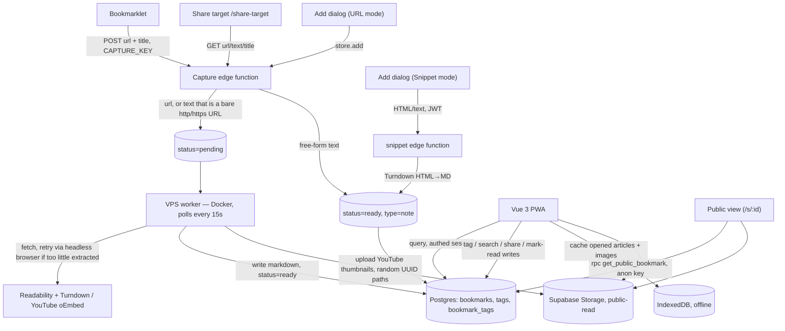

# Read Later — architecture

Personal read-it-later app, single owner, self-hosted. Capture a link (or a
snippet, or a raw note) via bookmarklet / PWA share-target / in-app dialog,
parse it into clean markdown on a VPS worker, read it later in a Vue 3 PWA.

This is the current-state reference — kept in sync with the code. For the
reasoning behind individual decisions (trade-offs considered, alternatives
rejected), see [Design history](#design-history) at the bottom.

## 1. System overview



Independently replaceable pieces:

| Component | Role | Stack |
|---|---|---|
| Bookmarklet | Popup-opener, no logic of its own | `javascript:` URL, built by `bookmarklet/build.ts` |
| `capture` edge function | Auth + insert/dedupe for url/text captures | Deno (Supabase Edge Functions) |
| `snippet` edge function | JWT-authed HTML→Markdown insert for pasted snippets | Deno (Supabase Edge Functions) |
| VPS worker | Poll `pending`, parse, write back | Node/TS + Bun, Docker, Playwright for JS-rendered pages |
| Vue 3 PWA | Reading list, reader, tags, search, sharing, offline cache | Vue 3, Pinia, vanilla CSS, `vite-plugin-pwa` |

## 2. Data model

```sql
create table bookmarks (
  id              uuid primary key default gen_random_uuid(),
  user_id         uuid not null references auth.users(id),
  url             text,                -- nullable: notes have no source URL
  url_normalized  text generated always as (lower(regexp_replace(url, '/+$', ''))) stored,
  type            text not null check (type in ('article', 'youtube', 'note')),
  status          text not null default 'pending'
                    check (status in ('pending', 'processing', 'ready', 'failed')),
  title           text,
  author          text,
  excerpt         text,
  content_md      text,
  thumbnail_url   text,
  word_count      int,
  reading_time    int,
  is_public       boolean not null default false,
  search_vector   tsvector generated always as (
                    setweight(to_tsvector('english', coalesce(title, '')), 'A') ||
                    setweight(to_tsvector('english', coalesce(content_md, '')), 'B')
                  ) stored,
  archived        boolean not null default false,
  read_at         timestamptz,
  error_message   text,
  created_at      timestamptz not null default now(),
  processed_at    timestamptz,

  constraint bookmarks_url_required_unless_note check (type = 'note' or url is not null)
);

create index bookmarks_status_idx on bookmarks (status) where status = 'pending';
create index bookmarks_user_created_idx on bookmarks (user_id, created_at desc);
create index bookmarks_search_idx on bookmarks using gin(search_vector);
create unique index bookmarks_url_normalized_uniq on bookmarks (url_normalized);

alter table bookmarks enable row level security;
create policy "owner access" on bookmarks for all using (auth.uid() = user_id);

create table tags (
  id    uuid primary key default gen_random_uuid(),
  name  text unique not null,
  color text default '#888888'
);

create table bookmark_tags (
  bookmark_id uuid not null references bookmarks(id) on delete cascade,
  tag_id      uuid not null references tags(id) on delete cascade,
  primary key (bookmark_id, tag_id)
);

create index bookmark_tags_tag_idx on bookmark_tags (tag_id); -- tag → bookmark is the query direction, not bookmark → tag

alter table tags enable row level security;
alter table bookmark_tags enable row level security;
create policy "authenticated only" on tags for all using (auth.role() = 'authenticated');
create policy "authenticated only" on bookmark_tags for all using (auth.role() = 'authenticated');
grant select, insert, update, delete on tags, bookmark_tags to authenticated;

create or replace function get_public_bookmark(bookmark_id uuid)
returns setof bookmarks
language sql security definer set search_path = public
as $$ select * from bookmarks where id = bookmark_id and is_public = true; $$;
grant execute on function get_public_bookmark(uuid) to anon;
```

Notes on the shape:
- `content_md` lives in Postgres `text`, not Storage — cheap at personal-archive
  scale, and lets `search_vector` (generated, stored) index it directly.
- No `folders` table. `status` + `archived` + `tags` (many-to-many, not a
  hierarchy) covers the river-of-news model — filtering, not nesting.
- `type = 'note'` covers both share-target free-text and in-app snippets.
  Notes skip the worker entirely and land at `status = 'ready'` on insert.
- `url_normalized` (lowercase host, strip trailing slash — not stripping
  `utm_*`/`fbclid` yet) backs a real unique index, so the capture endpoint's
  duplicate check can rely on a Postgres constraint violation (`23505`)
  instead of a racy find-then-insert.
- `bookmark_tags_tag_idx` exists because the composite primary key
  `(bookmark_id, tag_id)` only serves `bookmark_id`-first lookups, but the
  actual query ("bookmarks with tag X") goes the other direction.
- **Public sharing is not a blanket `select using (is_public = true)`
  policy.** RLS is row-level, not query-level — a blanket policy would let
  anyone holding the anon key list every public bookmark with no `id`
  filter, defeating "the id is the unguessable token." `get_public_bookmark`
  is `security definer` and only ever returns a row for an exact id match.
- New tables aren't auto-exposed to PostgREST by default in this project's
  config (`auto_expose_new_tables` off), so `tags`/`bookmark_tags` need an
  explicit `grant` in addition to RLS policies, or they're invisible to the
  Data API regardless of policy.

Migrations, in order: `20260725000001_bookmarks.sql` →
`20260726000001_bookmark_notes.sql` → `20260726000002_tags.sql` →
`20260726000003_search.sql` → `20260726000004_url_normalization.sql` →
`20260726000005_public_sharing.sql`.

## 3. Capture paths

Four ways in, all funneling into the same `bookmarks` table:

| Path | Entry point | Auth | Result |
|---|---|---|---|
| Bookmarklet | `bookmarklet/source.js` → `/capture` popup route | Existing PWA Supabase session | `store.add()`, same path as the in-app dialog |
| PWA share-target (Chrome/Android only) | `/share-target` (manifest `share_target`) → `capture` edge fn | `CAPTURE_KEY` bearer | url → `pending`; free text → `note`, `ready` |
| Add dialog — URL mode | `AddBookmarkDialog.vue` | Supabase session (client insert) | `pending` |
| Add dialog — Snippet mode | `AddBookmarkDialog.vue` → `snippet` edge fn | JWT (session) | `note`, `ready` |

**Bookmarklet.** The saved bookmark does nothing but open a small popup
(`bookmarklet/source.js`, `__APP_ORIGIN__` baked in at build time by
`bookmarklet/build.ts`):
```js
(() => {
  const params = new URLSearchParams({ url: location.href, title: document.title });
  window.open('__APP_ORIGIN__/capture?' + params.toString(), 'readlater-capture', 'width=380,height=260');
})();
```
`CaptureView.vue` reads `url`/`title` from the query string and calls
`useBookmarksStore().add()` — the same client-side path the Add dialog uses —
authenticated with whatever Supabase session is already active in that
browser. Why a popup instead of a direct `fetch()` from the source page: a
page's CSP (`connect-src`/`script-src`) governs requests *that page's own
script* makes, not where it navigates or opens a window to. Wikipedia is the
concrete case that forced this — its CSP has no `connect-src` override for
Supabase, so a bookmarklet `fetch()`ing the capture endpoint directly from
`en.wikipedia.org` fails outright. Trade-off: needs an active session in that
browser (redirects to `/login` via the router guard otherwise), and it's a
visible popup rather than an inline toast.

**Share-target.** Chrome-on-Android registers the PWA as an OS share target
(`app/vite.config.ts` → `VitePWA({ manifest: { share_target } })`); WebKit/
Safari has never implemented it, so iOS has no equivalent — the bookmarklet,
or a one-tap iOS Shortcut POSTing to `capture` with the same `CAPTURE_KEY`,
covers that case instead. `ShareTargetView.vue` reads `url`/`text`/`title`
from the query string and posts to the `capture` edge function.

**Snippet paste.** `AddBookmarkDialog.vue` has a URL/Snippet mode switch.
Snippet mode is a single textarea; on paste it reads both
`text/html` and `text/plain` from the clipboard. If HTML was captured,
`store.addSnippet()` calls the `snippet` edge function (JWT-authed, runs the
insert under the user's own session/RLS — deliberately not layered onto
`capture`, which authenticates non-browser callers via the static
`CAPTURE_KEY` and hardcodes the owner id):
```ts
const converted = typeof html === "string" ? new TurndownService().turndown(html).trim() : "";
const content = converted || (typeof text === "string" ? text.trim() : "");
// insert: { url: null, type: "note", status: "ready", content_md: content, title: truncateTitle(content) }
```
If no HTML was captured (plain typing, or a source with no `text/html`), it
falls back to the existing client-side `store.addNote()` — no round trip.

**Notes in general** (`type = 'note'`) have `content_md` written directly at
insert time and never touch the worker or the `pending` queue. They flow
through search, tags, and public sharing identically to articles/videos.

### Duplicate handling

Applies to `url`-type captures only — notes have no dedup key and always
insert fresh. `capture`'s insert relies on the `bookmarks_url_normalized_uniq`
index rather than a check-then-insert race: a `23505` violation on insert is
caught, the existing row is looked up by normalized URL, and the response
reports `{ status: 'duplicate', existingId, existingTitle, existingSavedAt }`
for the client to show a "continue anyway" dialog. Continuing calls
`POST /capture/:id/refresh`, which resets that row to `status=pending` so the
worker re-fetches — id, tags, and `is_public` are preserved, so an existing
share link keeps working.

### Capture-path auth model

Three trust levels, kept distinct on purpose:

| Actor | Mechanism | Why |
|---|---|---|
| Bookmarklet / share-target / iOS Shortcut | `capture` edge fn, static `CAPTURE_KEY` bearer | No browser session to lean on for share-target/Shortcut; intentionally weak — personal, single-user, low-value target |
| Add dialog (URL + Snippet modes) | PWA's own Supabase session (JWT) | Browser-facing, already logged in — snippet insert runs under the user's own RLS rather than the shared capture key |
| VPS worker | Supabase `service_role` (`SUPABASE_SECRET_KEY`) | Needs unconditional read/write on every row; bypasses RLS by design, never reaches a browser |
| Public view (`/s/:id`) | Supabase anon key + `get_public_bookmark` RPC | No session at all; scoped to a single exact-id match, not a table policy |

`service_role` leaking means full database read/write/delete; `CAPTURE_KEY`
leaking means someone can insert junk rows. Different blast radius, kept on
separate secrets. RLS (`auth.uid() = user_id`) stays on even though there's
only one user — it costs nothing and bounds a compromised PWA session to
"your own rows" if the app is ever reachable outside the VPN/LAN.

## 4. Worker processing

Bun/Node + TypeScript, Docker, polls rather than subscribes to Realtime — at
personal-bookmark volume a 15s interval is indistinguishable from instant and
avoids holding a websocket open just for this.

```ts
setInterval(() => pollOnce().catch(...), 15_000); // worker/src/index.ts

// per pending row: status → 'processing', parse, status → 'ready' | 'failed'
```

**Article pipeline** (`worker/src/parseArticle.ts`) — fetch → Readability →
Turndown, with a headless-browser fallback for JS-rendered pages:
```ts
const html = await fetchHtml(url);
let article = extractArticle(html, url); // Readability, requires >= 200 chars of textContent

if (!article && renderHtml) {
  const rendered = await renderHtml(url); // worker/src/browserRender.ts, Playwright chromium
  article = extractArticle(rendered, url);
}
```
Plain `fetch()` only ever sees server-rendered HTML, so SPA pages whose
content is assembled client-side (e.g. Perplexity search results) came back
empty and failed extraction outright. `browserRender.ts` retries with a
headless Chromium page (`page.goto(url, { waitUntil: "domcontentloaded",
timeout: 30_000 })`) only when the plain fetch wasn't substantial enough —
`domcontentloaded` rather than `networkidle`, because pages with persistent
background polling/streaming never reach network-idle and would otherwise
always time out; a navigation timeout is caught and whatever DOM loaded is
used rather than failing the bookmark outright. A duplicate leading heading
that repeats the article title is stripped from the converted markdown
(`stripDuplicateTitleHeading`) before it's stored.

**YouTube pipeline** (`worker/src/parseYoutube.ts`) — fetches title/author/
thumbnail from YouTube's public oEmbed endpoint (`worker/src/youtubeMeta.ts`),
no transcript, no HTML to convert so markdown is assembled by hand:
```ts
const content_md = `# ${meta.title}\n\n`;
```
Thumbnails are uploaded to Supabase Storage first (`worker/src/storage.ts`,
`youtube/${crypto.randomUUID()}.<ext>`) so `content_md` references the
Storage URL, not the original YouTube CDN URL. `word_count`/`reading_time`
are `null` for YouTube bookmarks — the reader shows the embedded player
instead of a transcript. (An earlier version shelled out to `yt-dlp` for
metadata + auto-captions and derived reading time from duration; that was
dropped because YouTube aggressively rate-limits/blocks scraping requests
from datacenter IPs like Contabo's, and oEmbed is a lightweight, unauthenticated
endpoint that doesn't hit the same wall.)

**Reading time**: `Math.max(1, Math.round(wordCount / 200))` for articles
(`worker/src/reading.ts`); YouTube bookmarks have no reading time.

**Retry UI**: the reader's failed-article view has a "Try again" button
(`ReaderView.vue`) that resets the bookmark to `pending` so the worker
reprocesses it — same underlying mechanism as the duplicate-refresh path.

## 5. Storage

- Markdown → `bookmarks.content_md` (Postgres `text`).
- YouTube thumbnails → Supabase Storage bucket `bookmark-assets`, random-UUID
  paths, public-read (no listing capability on a Supabase Storage public
  bucket by default, so public-read doesn't create a practical enumeration
  path even though thumbnails belong to bookmarks that may be public).
- Article body images are hot-linked from the source, not re-uploaded — only
  YouTube thumbnails go through `storage.ts`.

## 6. Frontend — Vue 3 PWA

Vue 3 + Pinia, vanilla CSS, no component library, `vite-plugin-pwa`
(`generateSW`/Workbox mode, `registerType: 'autoUpdate'`, no update-prompt UI
— single-user, deploys take effect on next load).

- **Reading list** (`ReadingListView.vue`, `BookmarkList.vue`,
  `BookmarkRow.vue`) — bordered rows, status tabs (All/Unread/Archived,
  `StatusTabs.vue`), tag filter bar (`TagFilterBar.vue`, ANDed with search),
  type icon per row, download/cached icon for offline pre-caching.
- **Reader** (`ReaderView.vue`, `ArticleContent.vue`) — markdown rendered via
  `markdown-it`, sanitized through `DOMPurify` before `v-html`. Header
  (`ReaderHeader.vue`) holds back/domain/actions; all row-level actions
  (open original, mark read/unread, share, archive, delete, font size) are
  consolidated into a single overflow menu (`ReaderMenu.vue`) rather than a
  row of separate icon buttons. Delete asks for confirmation
  (`window.confirm`); share opens `ShareDialog.vue`. Tagging is
  `TagInput.vue`, create-on-type against the `tags` table via upsert.
  `ReaderProgressBar.vue` tracks scroll position.
- **Sharing** (`ShareDialog.vue`) — toggle bound to `bookmark.is_public`
  (`store.setPublic()`), a read-only `/s/:id` link with copy button and
  `navigator.share()` where available. First-time enabling a share gets a
  confirm step (enumeration caveat, §2); unsharing is a plain toggle-off
  (reversible, same link if re-shared since the id is stable).
- **Public view** (`PublicReaderView.vue`, route `/s/:id`) — reuses
  `ArticleContent.vue`, no reader actions, fetches via the
  `get_public_bookmark` RPC rather than the authed store path. The router's
  `beforeEach` guard exempts `login` and `public` route names from the
  auth redirect (`app/src/router/index.ts`); it also awaits
  `auth.init()` before deciding, since a bookmarklet-opened popup can
  otherwise run the guard before the app's own session bootstrap resolves.
- **Search** — `.textSearch('search_vector', query, { type: 'websearch' })`;
  an empty query string is skipped client-side rather than sent (an empty
  `websearch_to_tsquery` matches nothing, not everything) and falls back to
  the normal `order('created_at')` list query.
- **Fonts** — self-hosted woff2 (not a CDN). Source Serif 4 for body copy,
  Inter for UI chrome, JetBrains Mono for metadata (domain, reading time,
  timestamp).

### Design tokens

One accent color, used sparingly — the primary action and the unread count,
nowhere else. Everything else is grayscale.

```css
:root {
  --rl-bg: #F5F4F2;
  --rl-surface: #FAFAF8;
  --rl-border: #E3E1DB;
  --rl-text-primary: #1A1A18;
  --rl-text-secondary: #6B6963;
  --rl-text-muted: #9B9990;
  --rl-accent: #D85A30;
  --rl-accent-tint: #FAECE7;
  --rl-on-accent-tint: #993C1D;
  --rl-on-accent: #FFFFFF;
}

[data-theme="dark"] {
  --rl-bg: #1C1B19;
  --rl-surface: #242320;
  --rl-border: #38362F;
  --rl-text-primary: #F0EEE8;
  --rl-text-secondary: #A8A69E;
  --rl-text-muted: #726F66;
  --rl-accent: #F0997B;
  --rl-accent-tint: #4A1B0C;
  --rl-on-accent-tint: #F0997B;
  --rl-on-accent: #2C1006;
}
```
Warm near-black rather than pure black for `--rl-bg` in dark mode, so it
keeps the light palette's character instead of reading as generic
OLED-dark. The accent lightens from the 400 to the 200 stop of the same
coral family in dark mode — the saturated version would glare on dark.

**Theme switching** (`stores/theme.ts`) — defaults to system preference on
first load, then remembers an explicit override in `localStorage`; applied
by setting `document.documentElement.dataset.theme` before the Vue bundle
mounts, so there's no flash-of-wrong-theme.

### Offline / PWA

Article content comes from the same PostgREST endpoint family as list/status
queries, which must stay network-fresh — so Workbox's URL-pattern runtime
caching can't safely distinguish them. Caching is app-level instead, via
IndexedDB (`idb` package, `app/src/lib/offlineDb.ts`, `read-later-offline`
DB):
- `articles` store — keyed by bookmark id → `{ content_md, images: {url,
  blob}[], cachedAt }`. Images referenced in the markdown are fetched from
  Supabase Storage and stored as blobs, swapped to `blob:` URLs at render
  time when offline.
- `bookmarksList` store — keyed by bookmark id → lightweight metadata
  (everything but `content_md`), written after every successful list
  `fetch()`, read as a fallback when `fetch()` fails offline.

`cacheBookmark(id)` (wrapped by the `offlineCache` Pinia store) has two
triggers: automatically after `ReaderView` successfully loads an article, or
manually via a download icon on unread rows in `BookmarkRow.vue` (tapping
again evicts it). `archive(id)` and `remove(id)` both evict the `articles`
cache entry for that id. Manifest: `display: standalone`, icons in
`public/icons/`, `apple-touch-icon` + `apple-mobile-web-app-capable` meta
tags for iOS "Add to Home Screen".

## 7. Authentication

Single-user app — no signup flow. The one account is created directly in the
Supabase dashboard; the PWA just needs a login form
(`supabase.auth.signInWithPassword`). `supabase-js` persists the session and
silently refreshes the token, so once logged in on a device it stays logged
in — correct for something installed to a homescreen. See §3 for the
capture-path auth model (bookmarklet/share-target/worker/public-view each
use a different mechanism, on purpose).

## 8. Deployment

Contabo VPS, `deploy.toml` (`type = "node-monorepo"`), domain
`readlater.mlnkv.net`:
- `readlater-app` — `app/Dockerfile`, port 80, `/*`, Supabase URL and
  publishable key baked in as build args.
- `readlater-worker` — `worker/Dockerfile`, no public port, only needs
  outbound access to Supabase (+ YouTube's oEmbed endpoint, + whatever the
  headless-browser fallback needs to reach).
- Bookmarklet — nothing to deploy. `bookmarklet/build.ts` bakes the app's
  origin into `bookmarklet/source.js` once; the built snippet is dragged to
  the bookmarks bar. No secret inside it, nothing to rotate when the PWA
  changes.

## 9. Deferred / open

- Twitter/X capture — needs Playwright-driven scraping, separate scoping
  pass given how fragile it'll be.
- PDF capture.
- URL normalization ignores tracking params (`utm_*`, `fbclid`, …) — add a
  strip-list if near-duplicate saves show up in practice.
- `bookmarks.fetch()` in the Pinia store loads the entire table, unpaginated
  — fine at personal-library scale today, but search/tags/notes all grow row
  count faster than articles-only did; keyset pagination
  (`created_at < cursor`) is the fix if it becomes visible.
- Note editing — notes have no source to re-fetch, so an edit is just a
  direct `content_md`/`title` update; no inline editor yet.
- SSRF hardening on the worker's fetch (reject loopback/private/link-local
  resolution) — the worker already fetches arbitrary user-submitted URLs via
  the bookmarklet today, so this is pre-existing exposure, not something any
  single feature introduced; worth doing, not urgent for a personal single-
  user app.
- Open Graph tags for `/s/:id` link previews need SSR/prerendering (this is
  a client-rendered SPA) — a tiny edge function serving prerendered OG tags
  to known crawler UAs, falling back to the SPA otherwise, would cover it.

## Design history

The docs above describe the system as built. For the reasoning behind
specific decisions — trade-offs weighed, alternatives rejected, security
analysis at the time — see the original design docs:

- [`docs/plans/read-later-new-capabilities.md`](plans/read-later-new-capabilities.md)
  — search, tags, public sharing, share-target capture, duplicate handling.
  Almost everything here shipped; §2's `is_public` enumeration analysis and
  §5's race-condition/unique-index reasoning are the parts worth reading in
  full rather than just the summary above.
- [`docs/plans/2026-07-25-pwa-design.md`](plans/2026-07-25-pwa-design.md) —
  installability, offline article caching, why app-level IndexedDB instead
  of Workbox runtime caching.
- [`docs/plans/2026-07-26-snippet-capture-design.md`](plans/2026-07-26-snippet-capture-design.md)
  — the Add-dialog snippet mode, HTML→Markdown conversion, why it's a
  separate JWT-authed edge function rather than an extension of `capture`.

Six early HTML visual explorations (color system, theme comparisons, login/
list/reader mockups) also live in `docs/*.html` — static, unmaintained since
the initial pass, superseded by the tokens in §6 above and the actual
implementation. Kept for reference on the original visual direction, not as
living documentation.
