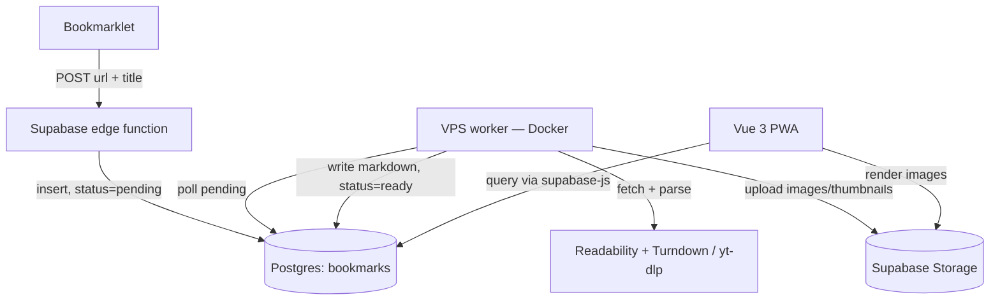

# Read Later — architecture

Personal read-it-later app. Capture a link via bookmarklet, parse it into clean markdown on a self-hosted worker, read it later in a Vue 3 PWA. Scope for v1: **articles and YouTube only** — Twitter/X and PDF are deferred.

## 1. System overview



Four independent pieces, each replaceable on its own:

| Component | Role | Stack |
|---|---|---|
| Bookmarklet | Capture URL + title, fire-and-forget | `javascript:` URL, vanilla JS |
| Supabase edge function | Fast auth + insert, no parsing | Deno (Supabase Edge Functions) |
| VPS worker | Poll, parse, write back | Node + TypeScript, Docker |
| Vue 3 PWA | Reading list + reader | Vue 3, Pinia, vanilla CSS |

## 2. Data model

```sql
create table bookmarks (
  id            uuid primary key default gen_random_uuid(),
  user_id       uuid not null references auth.users(id),
  url           text not null,
  type          text not null check (type in ('article', 'youtube')),
  status        text not null default 'pending'
                  check (status in ('pending', 'processing', 'ready', 'failed')),
  title         text,
  author        text,
  excerpt       text,
  content_md    text,               -- parsed markdown, lives in Postgres directly
  thumbnail_url text,                -- points at a Supabase Storage object
  word_count    int,
  reading_time  int,                 -- minutes, derived from word_count
  tags          text[] default '{}',
  archived      boolean not null default false,
  read_at       timestamptz,
  error_message text,
  created_at    timestamptz not null default now(),
  processed_at  timestamptz
);

create index bookmarks_status_idx on bookmarks (status) where status = 'pending';
create index bookmarks_user_created_idx on bookmarks (user_id, created_at desc);

alter table bookmarks enable row level security;
create policy "owner access" on bookmarks
  for all using (auth.uid() = user_id);
```

Notes:
- `content_md` as a plain `text` column, not a Storage file — cheap at personal-archive scale, and it means Postgres full-text search (`to_tsvector`) works on it later with no extra fetch.
- No `folders` table. Status (`pending → processing → ready/failed`) plus `archived` plus `tags[]` covers the river-of-news model — filtering, not hierarchy.
- `type` is just `article | youtube` for now. Adding `twitter` or `pdf` back later is a constraint change plus a new branch in the worker, not a schema redesign.

## 3. Capture flow

**Bookmarklet** — a `javascript:` URL saved as a regular bookmark. Unlike the original design (a self-contained script that POSTed straight to the capture edge function with a bearer key, run in the context of whatever page you're on), the saved bookmark (`bookmarklet/source.js`, built by `bookmarklet/build.ts`) does nothing but open a small popup to the PWA's own `/capture` route:
```js
(() => {
  const params = new URLSearchParams({ url: location.href, title: document.title });
  window.open('https://readlater.mlnkv.net/capture?' + params.toString(), 'readlater-capture', 'width=380,height=260');
})();
```
`CaptureView.vue` (mirroring the existing `/share-target` handler) reads `url`/`title` from the query string and inserts through `useBookmarksStore().add()` — the same client-side path the app's own "add bookmark" dialog uses — authenticated with whatever Supabase session is already active in that browser, then shows a brief "Saved" state and closes itself.

Why this instead of a direct `fetch()` from the target page:
- **No page CSP can block it.** A page's `connect-src`/`script-src` directives govern the *requests that page's own script makes* — `fetch()`, `XMLHttpRequest`, `new Function()`/`eval`. They do not govern where a page navigates or opens a window to. Wikipedia is a concrete example that forced this change: its CSP `default-src` (no explicit `connect-src` override) doesn't allowlist Supabase, so a bookmarklet doing `fetch(CAPTURE_ENDPOINT, ...)` directly from `en.wikipedia.org` fails outright, and no client-side workaround fixes that short of not making the request from that page's context at all.
- **No shared secret in the bookmarklet at all.** It carries `url`/`title` in a query string (not sensitive) and nothing else — no `CAPTURE_KEY`, no endpoint. The Android share-target path (`/share-target`, see `docs/plans/read-later-new-capabilities.md`) is session-based the same way. The `capture` edge function's `CAPTURE_KEY` bearer scheme below is kept for a future capture path with no browser session at all to lean on — e.g. an iOS Shortcut doing a raw HTTP POST — not for anything currently wired up.
- **No install step, and it works on iOS Safari** — mobile Safari has minimal extension support but bookmarklets work fine there, and once saved they sync via your browser's normal bookmark sync across every device signed in, desktop and mobile alike.
- **Trade-off:** the popup needs an active Supabase session in that browser (redirects to `/login` otherwise, via the router's normal auth guard), and it's a visible popup rather than an inline toast on the page you're reading — a small UX cost for working on every site regardless of CSP.

The `capture` edge function (below) is unrelated to the bookmarklet now — it's still the entry point for capture paths with no browser session to lean on.

**Edge function** — does the minimum needed to return fast, and now needs CORS handling since requests arrive from arbitrary origins:
```ts
const corsHeaders = {
  'Access-Control-Allow-Origin': '*',
  'Access-Control-Allow-Headers': 'authorization, content-type',
  'Access-Control-Allow-Methods': 'POST, OPTIONS'
};

serve(async (req) => {
  if (req.method === 'OPTIONS') return new Response(null, { headers: corsHeaders });

  const { url, title } = await req.json();
  if (req.headers.get('Authorization') !== `Bearer ${Deno.env.get('CAPTURE_KEY')}`) {
    return new Response('unauthorized', { status: 401, headers: corsHeaders });
  }
  const type = /youtube\.com\/watch|youtu\.be\//.test(url) ? 'youtube' : 'article';
  await supabase.from('bookmarks').insert({ url, title, type, status: 'pending' });
  return new Response('ok', { headers: corsHeaders });
});
```
No parsing happens here — Edge Functions have tight execution limits, and youtube/article parsing (especially spinning up jsdom or shelling out to yt-dlp) doesn't belong in a serverless function anyway.

## 4. Processing flow — VPS worker

Runs as a Docker container alongside your other self-hosted services. Polls rather than subscribes to Realtime for v1 — at personal-bookmark volume, a 10–15s poll interval is indistinguishable from instant, and it avoids holding open a websocket connection just for this.

```ts
setInterval(async () => {
  const { data: pending } = await supabase
    .from('bookmarks')
    .select('*')
    .eq('status', 'pending')
    .limit(5);

  for (const bookmark of pending ?? []) {
    await supabase.from('bookmarks').update({ status: 'processing' }).eq('id', bookmark.id);
    try {
      const result = bookmark.type === 'youtube'
        ? await parseYoutube(bookmark.url)
        : await parseArticle(bookmark.url);
      await supabase.from('bookmarks').update({
        ...result,
        status: 'ready',
        processed_at: new Date().toISOString()
      }).eq('id', bookmark.id);
    } catch (err) {
      await supabase.from('bookmarks').update({
        status: 'failed',
        error_message: String(err).slice(0, 500)
      }).eq('id', bookmark.id);
    }
  }
}, 15_000);
```

**Article pipeline**:
```ts
import { JSDOM } from 'jsdom';
import { Readability } from '@mozilla/readability';
import TurndownService from 'turndown';

async function parseArticle(url: string) {
  const html = await fetch(url).then(r => r.text());
  const dom = new JSDOM(html, { url });
  const article = new Readability(dom.window.document).parse();
  const content_md = new TurndownService().turndown(article.content);
  const word_count = content_md.split(/\s+/).length;
  return {
    title: article.title,
    author: article.byline,
    excerpt: article.excerpt,
    content_md,
    word_count,
    reading_time: Math.max(1, Math.round(word_count / 200))
  };
}
```

**YouTube pipeline** — shells out to `yt-dlp` for metadata and auto-generated captions, then assembles markdown by hand since there's no HTML to convert:
```ts
import { execFile } from 'node:child_process';

async function parseYoutube(url: string) {
  const meta = await runYtDlp(['--dump-json', '--skip-download', url]);
  const captions = await runYtDlp(['--write-auto-sub', '--sub-lang', 'en', '--skip-download', '-o', '-', url]);
  const transcript = vttToPlainText(captions);
  const content_md = `# ${meta.title}\n\n\n\n${transcript}`;
  const word_count = transcript.split(/\s+/).length;
  return {
    title: meta.title,
    author: meta.uploader,
    thumbnail_url: await uploadToStorage(meta.thumbnail),
    content_md,
    word_count,
    reading_time: Math.round(meta.duration / 60)
  };
}
```

**Why Node/TS over Elixir here**: this is I/O orchestration around two mature JS-ecosystem tools (`@mozilla/readability`, `yt-dlp` wrappers) rather than something that benefits from OTP supervision — there's no long-lived process state or fan-out concurrency that would justify the switch.

## 5. Storage strategy

- Markdown → `bookmarks.content_md` (Postgres `text`).
- Thumbnails and inline images → Supabase Storage bucket `bookmark-assets`, referenced by URL inside the markdown (``), so the reader just renders markdown normally with no special image-handling logic.

## 6. Frontend — Vue 3 PWA

Reuses the same shape as your other apps: Vue 3 + Pinia, vanilla CSS, no component library.

- **Reading list** — bordered rows (not cards), status filter tabs (All / Unread / Archived), type icon per row.
- **Reader view** — markdown rendered via `markdown-it`, sanitized through `DOMPurify` before `v-html`. Body copy in Source Serif 4; UI chrome in Inter; metadata (domain, reading time, timestamp) in JetBrains Mono. A 2px accent progress bar at the top of the reader tracks scroll position.
- **Fonts** — self-hosted woff2 files (not Google Fonts CDN) alongside the app on the VPS, consistent with your existing self-hosting setup.
- Marking read/archived is a simple Postgres update from the client via `supabase-js` — no extra API layer needed.

### Design tokens

One accent color, used sparingly — the primary "save/mark as read" action and the unread count, nowhere else. Everything else is grayscale.

```css
:root {
  --rl-bg: #F5F4F2;
  --rl-surface: #FAFAF8;
  --rl-border: #E3E1DB;
  --rl-text-primary: #1A1A18;
  --rl-text-secondary: #6B6963;
  --rl-text-muted: #9B9990;
  --rl-accent: #D85A30;
  --rl-accent-tint: #FAECE7;
  --rl-on-accent-tint: #993C1D;
  --rl-on-accent: #FFFFFF;
}

[data-theme="dark"] {
  --rl-bg: #1C1B19;
  --rl-surface: #242320;
  --rl-border: #38362F;
  --rl-text-primary: #F0EEE8;
  --rl-text-secondary: #A8A69E;
  --rl-text-muted: #726F66;
  --rl-accent: #F0997B;
  --rl-accent-tint: #4A1B0C;
  --rl-on-accent-tint: #F0997B;
  --rl-on-accent: #2C1006;
}
```
Warm near-black rather than pure black for `--rl-bg` in dark mode — keeps the same character as the light palette instead of reading as generic OLED-dark. The accent lightens from the 400 to the 200 stop of the same coral family in dark mode, since the saturated version would glare against a dark background.

### Theme switching

Default to system preference on first load, then let the choice be overridden and remembered:
```ts
const stored = localStorage.getItem('theme');
const theme = stored ?? (matchMedia('(prefers-color-scheme: dark)').matches ? 'dark' : 'light');
document.documentElement.dataset.theme = theme;
```
A small Pinia store wraps this so any component can toggle it; the toggle writes both `document.documentElement.dataset.theme` and `localStorage`. No flash-of-wrong-theme issue since this runs before the app mounts, ideally inlined in `index.html` rather than waiting on the Vue bundle.

## 7. Authentication

Three separate identities touch this system, each with a different trust level — worth keeping distinct rather than reusing one secret everywhere:

| Actor | Mechanism | Why |
|---|---|---|
| Bookmarklet / share-target | Vue 3 PWA's own Supabase session | Both just open/navigate to a route inside the already-logged-in app |
| VPS worker | Supabase `service_role` key | Needs to read/write every row unconditionally; bypasses RLS by design |
| Vue 3 PWA | Supabase Auth, email + password | The actual you, logging into the actual app |
| *(future)* session-less capture (e.g. iOS Shortcut) | Shared secret (`CAPTURE_KEY`) bearer token, via the `capture` edge function | No session to attach a login to — just enough to gate the insert endpoint |

**PWA login** — single-user, so there's no signup flow to build: create the one account directly in the Supabase dashboard (Authentication → Users → Add user), then the PWA just needs a login form:
```ts
const { data, error } = await supabase.auth.signInWithPassword({
  email: 'you@example.com',
  password: '...'
});
```
`supabase-js` persists the session and silently refreshes the token, so once you log in on a device it stays logged in — the right behavior for something installed to a homescreen.

**Worker key handling** — the `service_role` key bypasses RLS entirely: full read/write on every table, no ownership check. It must never reach a browser or the bookmarklet; it lives only as an env var / Docker secret on the VPS, separate from `CAPTURE_KEY`. Different blast radius if either leaks:
- `CAPTURE_KEY` leaks → someone can insert junk bookmark rows.
- `service_role` key leaks → someone can read, write, or delete everything in the database.

**Is RLS worth it for one user?** Technically the worker and PWA could both run as `service_role` and skip RLS, but keeping the `auth.uid() = user_id` policy from section 2 costs nothing — and means that if the PWA is ever reachable outside your LAN (e.g. exposed through Caddy for mobile access), a compromised PWA session is still bounded to "your own rows," not full database access.

## 8. Deployment

- Worker: new Docker service on the Contabo VPS, no public port required — it only needs outbound access to Supabase.
- PWA: same Docker + Caddy path-based routing pattern as your other apps (e.g. `readlater.mlnkv.net` or a path under an existing domain).
- Bookmarklet: nothing to deploy — it's a tiny static popup-opener (`bookmarklet/build.ts`, built once with the PWA's own origin baked in, then dragged to the bookmarks bar), pointed at the already-deployed PWA's `/capture` route. Nothing to redeploy or rotate when the PWA changes, since the bookmarklet carries no logic and no secret.

## 9. Implementation plan

**Phase 1 — capture path**
- [ ] Supabase project, `bookmarks` table + RLS policy
- [ ] Edge function: CORS handling, auth check, type detection, insert
- [ ] Bookmarklet: popup-opener script + `/capture` route with save/duplicate/fail states
- [ ] Manual test: click bookmarklet on a few different sites, including at least one with a strict CSP (e.g. Wikipedia) → popup opens and a row appears in Supabase table editor regardless of the page's CSP

**Phase 2 — worker: articles**
- [ ] Worker skeleton: polling loop, status transitions, error handling
- [ ] Article pipeline: fetch → Readability → Turndown → word count/reading time
- [ ] Dockerfile, deploy alongside existing VPS services
- [ ] Manual test: capture an article URL → row reaches `ready` with markdown populated

**Phase 3 — worker: YouTube**
- [ ] `yt-dlp` integration (metadata + auto-captions)
- [ ] VTT-to-plaintext transcript conversion
- [ ] Thumbnail upload to Supabase Storage
- [ ] Manual test: capture a YouTube URL → row reaches `ready` with transcript + thumbnail

**Phase 4 — reading list**
- [ ] Vue 3 + Pinia scaffold, Supabase client
- [ ] List view: status tabs, bordered rows, type icons
- [ ] Read / archive actions from the list

**Phase 5 — reader**
- [ ] `markdown-it` + `DOMPurify` rendering pipeline
- [ ] Self-hosted fonts (Inter, Source Serif 4, JetBrains Mono)
- [ ] Reader layout: line-length, margins, image rendering

**Phase 6 — polish**
- [ ] PWA manifest + install prompt
- [ ] Failed-item retry UI (re-queue a `failed` row to `pending`)
- [ ] Empty states

**Deferred**
- Twitter/X capture (needs Playwright — separate scoping pass given how fragile it'll be)
- PDF capture
- Full-text search over `content_md` (Postgres `tsvector`, or Meilisearch if you want parity with Huginn's search setup)
