# Read Later — Codebase & Architecture Audit

> **Audit Date:** August 25, 2026  
> **Scope:** `app/` (Vue 3 PWA), `worker/` (Bun + Readability worker), `supabase/` (Edge functions & Postgres migrations), `bookmarklet/`, configuration and infrastructure.

---

## 1. Executive Summary & Health Rating

| Area | Status | Summary |
|---|---|---|
| **Security & Privacy** | ⚠️ Medium Risk | Public sharing RPC over-exposes private owner IDs; SSRF exposure on worker fetches; Nginx serving HTML as CSS/JS on missing chunks. |
| **Performance & Bundle** | 🔴 High Impact | Huge bundle bloat from `md-editor-v3` + CodeMirror languages (~3MB PWA precache); Chromium spawned per-article; N+1 bookmark imports. |
| **Reliability & Offline** | 🔴 Critical Bug | Offline fallback in Pinia store never triggers on network failure (wiping cached data); bare URL regex misclassifies root domains. |
| **Code Cleanliness & Deps** | ⚠️ Minor Issues | Unused root dependencies (`mammoth`, `unpdf`); unused type/function exports; unhandled timer error in test teardown. |
| **Feature Completeness** | ⚠️ Incomplete Gaps | Translation flow bypasses DeepL for web articles; `PublicReaderView` lacks YouTube/PDF embed support; reading progress omitted from data export. |

---

## 2. Critical Bugs & Logic Issues

### 🔴 1. Offline Mode PostgREST Error Handling Bug (Wipes Cached Bookmarks)
- **Location:** [`app/src/stores/bookmarks.ts:109-136`](file:///Users/dmelnikov/code/read-later/app/src/stores/bookmarks.ts#L109-L136)
- **Problem:** In `queryBookmarks()`, `const { data } = await query.order(...)` ignores the `error` object returned by `supabase-js` and defaults to returning `(data ?? []) as T[]`. Because `supabase-js` returns `{ data: null, error: ... }` rather than throwing an exception on network failure, the `try / catch` block in `fetch()` **never enters the `catch` block**.
- **Consequence:** When the user opens the PWA offline, `bookmarks.value` is set to `[]` instead of loading `offlineDb.getBookmarksList()`. Immediately after, `offlineDb.replaceBookmarksList([])` executes and **wipes the user's IndexedDB offline bookmark cache**.
- **Recommended Fix:**
  ```ts
  // In queryBookmarks:
  const { data, error } = await query.order("created_at", { ascending: false });
  if (error) throw error;
  return data as T[];
  ```

---

### 🔴 2. Bare URL Root Domain Detection Bug
- **Location:** [`app/src/utils/captureText.ts:16-24`](file:///Users/dmelnikov/code/read-later/app/src/utils/captureText.ts#L16-L24) and [`supabase/functions/capture/captureLogic.ts:16-24`](file:///Users/dmelnikov/code/read-later/supabase/functions/capture/captureLogic.ts#L16-L24)
- **Problem:** `isBareUrl(s)` checks `t === parsed.toString()`. For bare domains like `https://example.com`, standard URL parsing canonicalizes the root path to `https://example.com/`. Thus, `"https://example.com" === "https://example.com/"` evaluates to `false`.
- **Consequence:** Pasting or sharing a bare domain URL (`https://example.com` or `http://site.org`) causes the app to misclassify it as a note snippet instead of an article URL.
- **Recommended Fix:**
  ```ts
  export function isBareUrl(s: string): boolean {
    const t = s.trim();
    try {
      const parsed = new URL(t);
      if (!ALLOWED_SCHEMES.has(parsed.protocol)) return false;
      return t === parsed.toString() || `${t}/` === parsed.toString();
    } catch {
      return false;
    }
  }
  ```

---

### 🔴 3. Inconsistent Translation Flow (Articles Bypass DeepL)
- **Location:** [`app/src/components/reader/ReaderMenu.vue:43-50, 151-171`](file:///Users/dmelnikov/code/read-later/app/src/components/reader/ReaderMenu.vue#L43-L50)
- **Problem:** `ReaderMenu.vue` differentiates bookmarks: if `bookmark.url` exists, clicking "Translate" opens an external tab to `translate.google.com`. Only notes/snippets (`!bookmark.url`) call the in-app `store.translateBookmark()` DeepL edge function.
- **Consequence:** Standard web articles never benefit from server-side DeepL translation, inline toggling, or the `translated_content_md` caching tested in E2E specs.

---

### 🔴 4. Public Reader View Missing YouTube & PDF Embeds
- **Location:** [`app/src/views/PublicReaderView.vue:38`](file:///Users/dmelnikov/code/read-later/app/src/views/PublicReaderView.vue#L38)
- **Problem:** `PublicReaderView.vue` renders `<ArticleContent :content-md="bookmark.content_md" />` without passing `:type`, `:youtube-video-id`, or `:thumbnail-url`.
- **Consequence:** Sharing a public YouTube bookmark (`/s/:id`) renders raw markdown rather than the interactive click-to-play video player.

---

### 🔴 5. Data Transfer Omission: Reading Progress Dropped
- **Location:** [`app/src/utils/dataTransfer.ts:14-40, 53-80`](file:///Users/dmelnikov/code/read-later/app/src/utils/dataTransfer.ts#L14-L40)
- **Problem:** The `progress` column added in migration [`20260811000001_reading_progress.sql`](file:///Users/dmelnikov/code/read-later/supabase/migrations/20260811000001_reading_progress.sql) was not added to `ExportBookmark`, `toExportBookmark()`, or `importBookmarks()`.
- **Consequence:** Exporting and re-importing bookmarks completely wipes reading scroll positions.

---

## 3. Performance Bottlenecks & Optimization

### ⚡ 1. ~3MB Bundle Bloat & 191 PWA Precached Files from Static `md-editor-v3`
- **Location:** [`app/src/components/reader/ArticleContent.vue:5-7`](file:///Users/dmelnikov/code/read-later/app/src/components/reader/ArticleContent.vue#L5-L7)
- **Problem:** `ArticleContent.vue` statically imports `MdEditor` from `md-editor-v3`. `md-editor-v3` pulls in `@codemirror/language-data`, which includes syntax highlighters for over 100 programming languages (Cobol, Fortran, APL, Pascal, Brainfuck, SAS, etc.).
- **Impact:** Vite generates **191 assets (~3MB)** that Workbox precaches on the user's mobile device on first visit, even though editing is only used when the user explicitly enters edit mode.
- **Recommended Fix:** Dynamically import `MdEditor` using `defineAsyncComponent` only when `editing` is `true`:
  ```vue
  <script setup lang="ts">
  import { defineAsyncComponent } from 'vue';
  const MdEditor = defineAsyncComponent(() =>
    import('md-editor-v3').then((m) => {
      import('md-editor-v3/lib/style.css');
      return m.MdEditor;
    })
  );
  </script>
  ```

---

### ⚡ 2. Playwright Spawns Full Chromium Instance on Every Render Fallback
- **Location:** [`worker/src/browserRender.ts:4-19`](file:///Users/dmelnikov/code/read-later/worker/src/browserRender.ts#L4-L19)
- **Problem:** `renderWithBrowser()` calls `chromium.launch()` inside the function for every article that triggers browser fallback. Launching a new Chromium process takes 1–2 seconds and consumes substantial memory.
- **Recommended Fix:** Launch a shared browser instance once at worker startup (or lazily on first need) and create fresh browser contexts/pages per job.

---

### ⚡ 3. N+1 Sequential Network Calls in Bookmark Import
- **Location:** [`app/src/stores/dataTransfer.ts:59-97`](file:///Users/dmelnikov/code/read-later/app/src/stores/dataTransfer.ts#L59-L97)
- **Problem:** `importBookmarks()` sequentially iterates through every bookmark and tag, issuing individual `insert` and `upsert` requests. An import of 200 bookmarks with 2 tags each makes ~1,000 sequential HTTP requests.
- **Recommended Fix:** Batch insert bookmarks and resolve unique tags in bulk before inserting `bookmark_tags`.

---

### ⚡ 4. Worker Polling Overlap / Race Condition
- **Location:** [`worker/src/index.ts:57-59`](file:///Users/dmelnikov/code/read-later/worker/src/index.ts#L57-L59)
- **Problem:** `setInterval(pollOnce, 15_000)` fires every 15s regardless of whether the previous poll finished. If a batch takes >15s (e.g. Playwright rendering or network timeouts), multiple poll routines run concurrently and race on the same pending bookmarks.
- **Recommended Fix:** Use a recursive `setTimeout` loop or an `isPolling` boolean guard.

---

### ⚡ 5. Object URL Leak in Offline Hydration
- **Location:** [`app/src/lib/offlineDb.ts:82-91`](file:///Users/dmelnikov/code/read-later/app/src/lib/offlineDb.ts#L82-L91)
- **Problem:** `hydrateArticleContent()` creates `URL.createObjectURL(image.blob)` for every cached image every time an article is loaded, with no corresponding `URL.revokeObjectURL()`.

---

## 4. Security & Vulnerability Analysis

### 🔒 1. Nginx Fallback Serving HTML as Missing JS/CSS (MIME Type Errors)
- **Location:** [`app/nginx.conf:7-9`](file:///Users/dmelnikov/code/read-later/app/nginx.conf#L7-L9)
- **Problem:** `location / { try_files $uri $uri/ /index.html; }` serves `index.html` (HTTP 200 `text/html`) when a browser requests an old/missing chunk under `/assets/`. This explains the production failure in [`error.txt`](file:///Users/dmelnikov/code/read-later/error.txt) (`The stylesheet ... was not loaded because its MIME type, “text/html”, is not “text/css”`).
- **Recommended Fix:** Add a dedicated `/assets/` block in `nginx.conf`:
  ```nginx
  location /assets/ {
      try_files $uri =404;
      expires 1y;
      add_header Cache-Control "public, max-age=31536000, immutable";
  }
  ```

---

### 🔒 2. Data Exposure in Public Sharing RPC (`get_public_bookmark`)
- **Location:** [`supabase/migrations/20260726000005_public_sharing.sql:19-21`](file:///Users/dmelnikov/code/read-later/supabase/migrations/20260726000005_public_sharing.sql#L19-L21)
- **Problem:** `get_public_bookmark` uses `security definer` and does `select * from bookmarks`. This returns private internal columns to unauthenticated anonymous users: `user_id` (owner UUID), `pdf_path` (private storage bucket path), `error_message`, and `progress`.
- **Recommended Fix:** Restrict the `select` projection to public-safe columns (`id`, `title`, `author`, `excerpt`, `content_md`, `thumbnail_url`, `youtube_video_id`, `created_at`, `word_count`, `reading_time`, `is_public`).

---

### 🔒 3. SSRF & Unbounded Fetching in Worker
- **Location:** [`worker/src/parseArticle.ts:8`](file:///Users/dmelnikov/code/read-later/worker/src/parseArticle.ts#L8)
- **Problem:** `fetch(url)` does not restrict fetching of loopback/private IPs (`127.0.0.1`, `10.0.0.0/8`, `169.254.169.254` AWS/GCP metadata endpoints, Docker internal container hostnames). There is also no request timeout (`AbortSignal.timeout`) or max byte length.
- **Recommended Fix:** Enforce timeouts (`AbortSignal.timeout(15_000)`), add standard `User-Agent` headers, and reject private IP resolutions.

---

### 🔒 4. Third-Party Image Caching Fails Silently via CORS
- **Location:** [`app/src/stores/offlineCache.ts:37`](file:///Users/dmelnikov/code/read-later/app/src/stores/offlineCache.ts#L37)
- **Problem:** `cacheBookmark` attempts `fetch(url).then(r => r.blob())` directly from the browser on hot-linked third-party image URLs. Browsers block these requests due to CORS unless the remote image host sets `Access-Control-Allow-Origin: *`.

---

## 5. Dead Code & Unused Dependencies

| Location | Item | Category | Status / Action |
|---|---|---|---|
| [`package.json:9-10`](file:///Users/dmelnikov/code/read-later/package.json#L9-L10) | `mammoth`, `unpdf` | Unused Dependency | Can be removed from root `package.json` (Deno functions use `npm:mammoth` / `npm:unpdf` directly). |
| [`worker/src/parseArticle.ts:40`](file:///Users/dmelnikov/code/read-later/worker/src/parseArticle.ts#L40) | `createTurndownService` | Unused Export | Not imported by any other module. |
| [`app/src/lib/offlineDb.ts:6`](file:///Users/dmelnikov/code/read-later/app/src/lib/offlineDb.ts#L6) | `CachedImage` | Unused Export | Interface exported but unused. |
| [`app/src/utils/dataTransfer.ts:6`](file:///Users/dmelnikov/code/read-later/app/src/utils/dataTransfer.ts#L6) | `ExportTag` | Unused Export | Interface exported but unused outside module. |
| [`app/src/components/reader/ArticleContent.test.ts`](file:///Users/dmelnikov/code/read-later/app/src/components/reader/ArticleContent.test.ts) | Vitest Teardown Exception | Test Flakiness | `ReferenceError: document is not defined` from `@vavt/util` timers firing during test teardown. |

---

## 6. Unfinished Features & Edge Cases

1. **Stuck `processing` Status on Worker Crash**:
   If the worker process restarts or terminates while processing a bookmark, the bookmark remains stuck at `status = 'processing'` permanently. The worker needs a startup or periodic sweep to reset stale `processing` bookmarks (`processed_at < now() - interval '5 minutes'`) back to `pending`.
2. **Missing `vite:preloadError` Handler**:
   When new code is deployed and chunk hashes change, active clients get dynamic import errors when navigating. Adding `window.addEventListener('vite:preloadError', () => window.location.reload())` in [`app/src/main.ts`](file:///Users/dmelnikov/code/read-later/app/src/main.ts) provides seamless auto-recovery.
3. **PDF Domain Label in List**:
   [`app/src/utils/format.ts:2`](file:///Users/dmelnikov/code/read-later/app/src/utils/format.ts#L2) defaults `domainFromUrl(null)` to `"Note"`. For PDF bookmarks (`type = 'pdf'`), this displays `"Note"` in the list row instead of `"PDF"`.
4. **CI / Git Hook Test Coverage**:
   [`lefthook.yml`](file:///Users/dmelnikov/code/read-later/lefthook.yml) runs linting, formatting, and typechecking, but does not run unit tests (`bun run test`) or Deno function checks.

---

## 7. Recommended Remediation Priority Matrix

```mermaid
flowchart TD
    A["Priority 1: Stability & Offline"] --> A1["Fix queryBookmarks error handling in bookmarks.ts"]
    A --> A2["Fix isBareUrl root domain check in captureText.ts & captureLogic.ts"]
    A --> A3["Fix Nginx /assets/ 404 rule and cache headers in nginx.conf"]
    
    B["Priority 2: Performance & Bundle"] --> B1["Async lazy-load md-editor-v3 in ArticleContent.vue"]
    B --> B2["Reuse single Playwright Chromium instance in worker"]
    B --> B3["Remove unused mammoth/unpdf from root package.json"]

    C["Priority 3: Feature Polish & Security"] --> C1["Unify in-app DeepL translation for articles and notes"]
    C --> C2["Pass props to ArticleContent in PublicReaderView"]
    C --> C3["Include progress in export/import dataTransfer"]
    C --> C4["Sanitize columns in get_public_bookmark RPC"]
```



---

## 8. Remediation Status

All prioritized items have been remediated and verified according to [`docs/plans/2026-08-25-audit-remediation-plan.md`](plans/2026-08-25-audit-remediation-plan.md). All test suites (315 Vitest, 18 Worker Bun, 6 Bookmarklet Bun, 96 Deno Edge Functions) pass cleanly with 0 errors.

