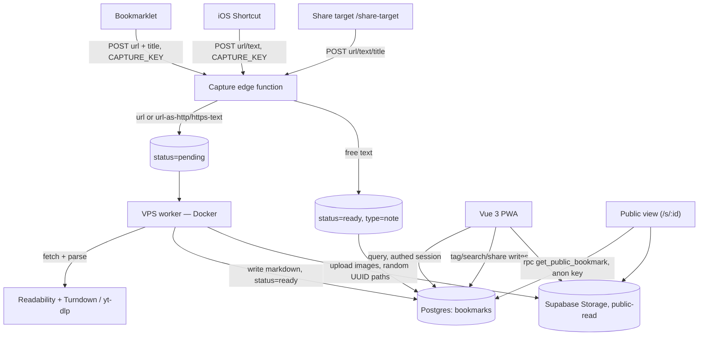

# Read Later — new capabilities

Extends the existing architecture (bookmarklet → Supabase edge function → VPS worker → Vue 3 PWA) with four additions: **full-text search**, **tags**, **public sharing via URL**, and **PWA share-target capture** (including direct-text notes that skip the worker entirely).

This is a **single-owner personal app** (one `OWNER_USER_ID`, one RLS policy of `auth.uid() = user_id`, capture auth is a single static bearer key baked into the bookmarklet). That constraint simplifies some things below (no multi-tenant RLS to design) and is called out explicitly where it changes the recommendation from what a multi-user app would need.

Grounded against the current code: `supabase/migrations/20260725000001_bookmarks.sql`, `supabase/functions/capture/*`, `app/src/router/index.ts`, `app/src/stores/bookmarks.ts`, `app/src/lib/{supabase,offlineDb}.ts`, `app/src/components/reader/*`, `worker/src/storage.ts`, `app/vite.config.ts`.

---

## 0. Pre-existing state that affects this plan

- **`bookmarks.tags text[]` already exists** (migration line 15) and is completely unused — every reference in the app is an empty array in test fixtures (`grep` confirms no read/write anywhere). Section 2 below replaces this with a relational model; the migration must **drop the dead column**, not leave two parallel tag representations.
- **The root route is auth-gated.** `router/index.ts:13-17` redirects anything except `login` to `/login` when `!auth.isAuthenticated`. The original plan's share URL (`/?id=<uuid>`) would send an anonymous visitor straight to the login screen before they ever saw a bookmark — public sharing needs its own route, explicitly exempted from that guard. See §3.
- **IndexedDB schema is at `DB_VERSION = 1`** (`offlineDb.ts:30`) with a fixed `OfflineBookmarkMeta` shape. Tags and any offline search fallback need a schema bump (`DB_VERSION = 2`) and an `upgrade()` migration path, not just a type change.
- **The capture edge function's auth is a single static `CAPTURE_KEY`** shared by every caller (`checkAuth.ts`), currently embedded in the bookmarklet's own source. This is intentionally weak (personal, single-user, low-value target) but it means anything new that calls this function — share-target, iOS Shortcut — inherits the same trust model. That's fine and consistent; it's called out in §4 so it isn't mistaken for an oversight.
- **`bookmarks.fetch()` in the Pinia store loads the entire table, unpaginated** (`bookmarks.ts:42-58`). Not in scope to fix here, but search + tags + notes all grow row count faster than articles alone did, so it's noted in §7 as a related follow-up.

---

## 1. Search

Postgres full-text search via a generated `tsvector` column — no new infrastructure, since it's already Supabase Postgres. Title weighted above body content.

```sql
alter table bookmarks
  add column search_vector tsvector
  generated always as (
    setweight(to_tsvector('english', coalesce(title, '')), 'A') ||
    setweight(to_tsvector('english', coalesce(content_md, '')), 'B')
  ) stored;

create index bookmarks_search_idx on bookmarks using gin(search_vector);
```

```js
const { data } = await supabase
  .from('bookmarks')
  .select('*')
  .textSearch('search_vector', query, { type: 'websearch' });
```

> If the library outgrows plain FTS (typo tolerance, ranking quality), Meilisearch — already self-hosted for Huginn — is a drop-in swap isolated to this query layer. Not needed for v1.

### Performance

- **Write cost**: the column is `generated ... stored`, so it's recomputed on every insert/update of `title`/`content_md` — that's once per capture (worker writes `content_md` exactly once when it flips to `ready`) plus rare edits, not a hot path. No concern at personal-library scale.
- **Read cost / ranking**: `websearch_to_tsquery` + GIN is fine unbounded, but order results with `ts_rank(search_vector, websearch_to_tsquery('english', query))` rather than `created_at` when a query is active, or relevance-ranked results feel broken.
- **Empty-query guard**: `websearch_to_tsquery('english', '')` returns an empty tsquery that matches nothing (not "everything") — the client must skip `.textSearch(...)` entirely and fall back to the normal `.order('created_at')` list query when the search box is empty, rather than calling textSearch with an empty string.
- **Combining with tags** (§2): `search_vector @@ query AND id in (select bookmark_id from bookmark_tags where tag_id = any(...))` — for this to stay fast as the library grows, the `bookmark_tags` table needs an index with `tag_id` leading (see §2), since the join direction here is tag → bookmark, not bookmark → tag.
- **Pagination**: not new to this feature, but a ranked/filtered query is where an unpaginated `select *` (see §0) first becomes visible as a real cost. Recommend keyset pagination (`created_at < cursor`) if/when this is addressed — not blocking for v1.
- **Client debounce**: the search input should debounce ~300ms before firing a query; add a small `useDebouncedRef` composable alongside the existing `useScrollProgress.ts` pattern rather than wiring a raw `@input` handler.

### Security

- No injection risk from the query text itself — `.textSearch()` goes through supabase-js's parameterized query builder, not raw SQL string concatenation.
- Cap query length client-side (e.g. 200 chars) purely to avoid pathological `websearch_to_tsquery` parse cost on pasted garbage; not a real vulnerability, just cheap defensiveness.

### Offline

FTS is a Postgres-only capability — it doesn't run against the cached IndexedDB list. When offline (`bookmarks.ts:50-54` fallback path), search should degrade to a plain case-insensitive substring match over the cached `title`/`excerpt` fields already in `OfflineBookmarkMeta`, not silently do nothing. `content_md` isn't in the cached metadata (`stripContentMd`), so offline search is title/excerpt-only by construction — worth a small "searching titles only (offline)" hint in the UI so it doesn't look broken.

---

## 2. Tags

Flat many-to-many, not a nested collection hierarchy. Create-on-type in the UI.

```sql
-- Replaces the dead `tags text[]` column from the original schema.
alter table bookmarks drop column tags;

create table tags (
  id uuid primary key default gen_random_uuid(),
  name text unique not null,
  color text default '#888888'
);

create table bookmark_tags (
  bookmark_id uuid not null references bookmarks(id) on delete cascade,
  tag_id      uuid not null references tags(id) on delete cascade,
  primary key (bookmark_id, tag_id)
);

-- Composite PK indexes (bookmark_id, tag_id) in that order, which is the
-- wrong direction for "find all bookmarks with tag X" — add the reverse index:
create index bookmark_tags_tag_idx on bookmark_tags (tag_id);

alter table tags enable row level security;
alter table bookmark_tags enable row level security;

-- Single-owner app: no per-user scoping needed on these tables, but RLS must
-- still be turned on and gated to authenticated, or the anon (publishable)
-- key — which is intentionally public, embedded in client JS — gets full
-- read/write on both tables by default the moment RLS is enabled with no
-- policy... and *unrestricted* access if RLS is left off entirely, which is
-- what the original draft of this section did (no RLS statements at all).
create policy "authenticated only" on tags
  for all using (auth.role() = 'authenticated');

create policy "authenticated only" on bookmark_tags
  for all using (auth.role() = 'authenticated');
```

List view: tag filter bar, ANDed with search — `search_vector @@ query AND tag_id in (...)` (see §1 for the required index direction).

### Performance

- `bookmark_tags_tag_idx` above is the main addition versus the original draft — without it, "filter by tag" does a sequential scan over `bookmark_tags` since the composite PK only helps `bookmark_id`-first lookups.
- Create-on-type tagging should be an upsert (`insert into tags (name) values (...) on conflict (name) do nothing returning id`, then insert the join row) rather than a check-then-insert from the client — avoids a round trip and a race between two rapid tag creations of the same name.

### UI

- New `TagInput.vue` component (reader view, near `ReaderActions.vue`) — chips with an add-affordance that creates-on-type against the `tags` table via the upsert above.
- `ReadingListView.vue` gets a tag filter bar; selecting tags updates the store query alongside the existing `filter` (all/archived) state in `bookmarks.ts`.
- `bookmarks` store needs `addTag(bookmarkId, name)` / `removeTag(bookmarkId, tagId)` actions, and the `Bookmark` TS type (`lib/supabase.ts:24`) changes from `tags: string[]` to `tags: { id: string; name: string; color: string }[]` (or a separate join query) — this is a breaking type change for every place currently typing `tags: []` in test fixtures.
- Offline cache (`offlineDb.ts`): `OfflineBookmarkMeta` needs `tags` added, and `DB_VERSION` bumped with an `upgrade()` step, per §0.

---

## 3. Public sharing

Share URL format: `https://readlater.mlnkv.net/s/<bookmark uuid>` (own route, not the auth-gated root — see §0). The bookmark's own id doubles as the public token — unguessable, no separate slug table.

### The enumeration problem with a blanket RLS policy

The original draft's policy:

```sql
create policy "public bookmarks are readable by anyone"
  on bookmarks for select
  using (is_public = true);
```

This does more than let someone with a specific id read that one row. Because RLS is **row-level**, not **query-level**, anyone holding the anon/publishable key (which is meant to be public — it's embedded in the built client JS) can run `supabase.from('bookmarks').select('*')` with **no `id` filter at all** and get back *every* currently-public bookmark, not just the one they were handed a link to. That quietly breaks the "id is the unguessable token" premise: the token stops mattering once there's a policy that hands out the whole public set to anyone who asks.

Whether that's acceptable depends on intent — "here's my public reading list" vs. "here's one link I shared." Recommendation: use a `security definer` RPC gated on an exact id match instead of a blanket table policy, so a public bookmark is only reachable if you already have its id:

```sql
create or replace function get_public_bookmark(bookmark_id uuid)
returns setof bookmarks
language sql
security definer
set search_path = public
as $$
  select * from bookmarks where id = bookmark_id and is_public = true;
$$;

grant execute on function get_public_bookmark(uuid) to anon;
```

```js
// Public view — no table-level select policy for anon at all.
const { data } = await supabase.rpc('get_public_bookmark', { bookmark_id: id });
```

No new **write** policy is needed for toggling `is_public` — the existing `"owner access" ... for all using (auth.uid() = user_id)` policy already covers `update`, since this is a single-owner app. The original draft's implied gap (no explicit write policy shown) isn't actually a gap here.

### Storage

- Thumbnails are uploaded to a random-UUID path (`worker/src/storage.ts:11`, `${crypto.randomUUID()}.${ext}`), so making the bucket public-read doesn't create a practical enumeration path — there's no listing capability on a Supabase Storage public bucket by default, and paths aren't guessable. This resolves what looked like a risk in the initial review; just confirm bucket listing stays off (default) when making it public-read.
- Article body images are hot-linked from the source, not re-uploaded (only YouTube thumbnails go through `storage.ts`), so there's no additional exposure from those.

### Routing

- Add a new route in `router/index.ts`, e.g. `{ path: "/s/:id", name: "public", component: () => import("../views/PublicReaderView.vue"), props: true }`.
- The `beforeEach` guard (`router/index.ts:13-17`) must exempt `to.name === "public"` from the `!auth.isAuthenticated` redirect — currently it only exempts `"login"`.
- `PublicReaderView.vue` reuses `ArticleContent.vue` for rendering but has no `ReaderActions`/archive/delete/tag controls, and fetches via the RPC above rather than `bookmarksStore.fetchOne` (which assumes an authenticated session's RLS view).
- **404 behavior**: RPC returns zero rows both when the id doesn't exist and when `is_public = false` — render the same "not found" view for both, per the original plan's intent (don't leak which case it is). No special-casing needed since the RPC already collapses both cases into "no row."

### UI actions for sharing / unsharing

This was missing concrete detail before — the actual wiring:

- **`ReaderHeader.vue`** gets a new icon button (e.g. `IconWorld` from `@tabler/icons-vue`, already the icon set in use) next to the existing archive/delete/external-link buttons, emitting a new `share` event — mirrors the existing `emit('archive')` / `emit('delete')` pattern at `ReaderHeader.vue:29-44`.
- **New `ShareDialog.vue`** component, opened from that button:
  - A toggle switch bound to `bookmark.is_public`, calling a new store action `setPublic(id, isPublic)` (mirrors `archive(id)` at `bookmarks.ts:112-117`) on change — persists immediately, no separate "save" step.
  - When public: a read-only text field with the full `https://readlater.mlnkv.net/s/<id>` link, a "Copy link" button (Clipboard API, with `document.execCommand('copy')` fallback for older WebKit), and — where available — a native share button using `navigator.share()` for one-tap sharing to Messages/etc. on mobile.
  - **First-time-share confirmation**: given the enumeration caveat above, flipping a bookmark public for the first time should get a lightweight confirm step (same `window.confirm` pattern already used for delete in `ReaderHeader.vue:20-24`), not a silent toggle.
  - **Unsharing** is just flipping the same toggle off — no confirmation needed (reversible, and re-sharing regenerates the same link since the id is stable), matching the original plan's "no token revocation bookkeeping" framing.
- **List visibility**: `BookmarkRow.vue` gets a small globe/pill indicator when `is_public` is true, so shared state is visible from the list, not only discoverable by opening each bookmark.
- **Later, not v1**: Open Graph meta tags for link-preview cards need SSR or prerendering, since this is a client-rendered SPA (e.g., a tiny edge function that serves prerendered OG tags to known crawler user agents on `/s/:id`, falling back to the SPA for everyone else). Worth a phase 2 note, not a blocker.

---

## 4. Capture: share target + direct-text notes

### Manifest

Added to the existing `VitePWA({ manifest: { ... } })` block in `app/vite.config.ts:11-24`:

```json
"share_target": {
  "action": "/share-target",
  "method": "GET",
  "params": { "title": "title", "text": "text", "url": "url" }
}
```

GET is sufficient — no files involved, so no need to handle POST multipart in the service worker.

### Platform support

Confirmed: **registering as a share target is Chrome-on-Android only.** WebKit/Safari has never implemented `share_target`, and iOS has no path around it. For iOS, capture stays on the bookmarklet — or a one-tap Apple Shortcut that POSTs `url`/`text` to the same edge function covers the same use case with no code. That Shortcut reuses the same static `CAPTURE_KEY` bearer auth already baked into the bookmarklet (§0) — consistent with the existing trust model, not a new weaker path.

### Three-way capture logic

The edge function (`supabase/functions/capture/index.ts`) now has to route three distinct inputs, not one:

| Input | Behavior |
|---|---|
| `url` present | existing flow — insert `status=pending`, worker fetches + parses |
| `text` present, and *is itself* a bare URL | same as above — treat the text as the URL |
| `text` present, free-form | **new** — insert directly as a note, `status=ready`, no worker involved |

```ts
const ALLOWED_SCHEMES = new Set(["http:", "https:"]);

function isBareUrl(s: string): boolean {
  const t = s.trim();
  try {
    const parsed = new URL(t);
    return t === parsed.toString() && ALLOWED_SCHEMES.has(parsed.protocol);
  } catch {
    return false;
  }
}

function truncateTitle(text: string, max = 100): string {
  if (text.length <= max) return text;
  const slice = text.slice(0, max);
  const lastSpace = slice.lastIndexOf(' ');
  const cut = lastSpace > 0 ? slice.slice(0, lastSpace) : slice; // fallback: no space found, hard cut
  return cut.trim() + '…';
}

async function handleCapture(input: { url?: string; title?: string; text?: string }) {
  const url = input.url?.trim();
  const text = input.text?.trim();

  if (url) return insertPendingUrl(url, input.title);
  if (text && isBareUrl(text)) return insertPendingUrl(text, input.title);

  if (text) {
    return insertReadyNote({ title: truncateTitle(text), content_md: text });
  }

  throw new Error('capture requires url or text');
}
```

`insertReadyNote` writes `type='note'`, `status='ready'`, `content_md` = the raw shared text (plain text is valid markdown as-is). It never touches the pending queue, so the worker doesn't need to know notes exist.

### Security: scheme allow-list is load-bearing, not cosmetic

The original draft's `isBareUrl` accepted anything `new URL()` could parse and round-trip, which includes `javascript:`, `data:`, `file:`, and similar. Since a matched "bare URL" flows straight into `insertPendingUrl` → the worker fetches it (`worker/src/index.ts` polls `status=pending` and fetches unconditionally), an unrestricted scheme isn't just a data-quality issue — it's handing the worker a URL to fetch that it shouldn't. The `ALLOWED_SCHEMES` check above (http/https only) closes that off.

Two related, slightly larger points worth a conscious decision (not necessarily blocking v1, given this is a personal single-user app and the worker already fetches arbitrary user-submitted URLs today via the bookmarklet):
- Basic SSRF hardening on the worker's fetch (reject resolution to loopback/private/link-local ranges) would be a good hardening step given the worker runs on a VPS that may have internal network reachability, but this is pre-existing exposure from the bookmarklet flow too, not something this feature introduces — call it out as a follow-up rather than scope-creeping this plan.
- `detectType` (`supabase/functions/capture/detectType.ts`) already assumes `new URL(url)` succeeds for any inbound `url` field; the scheme check above should live in a shared helper so both the existing `url`-field path and the new bare-text-URL path get the same validation, rather than only gating the new code path.

### Schema

```sql
-- 'type' already distinguishes article | youtube; add note
alter table bookmarks
  add column type text not null default 'article'
  check (type in ('article', 'youtube', 'note'));
```

Notes flow through search, tags, and public sharing identically to articles — nothing in §1–3 needs to special-case them.

### Landing view

`/share-target` is a thin view: read `url`/`text`/`title` from the query string, POST to the capture edge function, show a brief confirmation, route to the list. No fetch/parse spinner needed for notes since they're `ready` on arrival.

---

## 5. Duplicate handling

Applies to `url`-type captures only (bookmarklet and share-target-with-url) — notes have no natural dedup key, so they always insert fresh.

`/capture` now checks for an existing row with the same normalized URL *before* inserting. Instead of silently inserting a duplicate or silently overwriting, it returns the conflict and lets the client decide:

```ts
async function insertPendingUrl(url: string, title?: string) {
  const existing = await findByNormalizedUrl(url);
  if (existing) {
    return { status: 'duplicate', existingId: existing.id, existingTitle: existing.title, existingSavedAt: existing.created_at };
  }
  const id = await insertPending(url, title);
  return { status: 'created', id };
}
```

Normalization: lowercase host, strip trailing slash. Not stripping tracking params (`utm_*`, `fbclid`, …) for now — easy to add later if duplicates start slipping through with different query strings.

### Race condition

`findByNormalizedUrl` then `insertPending` isn't atomic — two rapid captures of the same URL (double-tap share, or a page auto-triggering both the bookmarklet and a Shortcut) can both pass the check before either insert lands, producing two rows. Add a **unique index on the normalized URL** so the DB enforces this instead of relying on a check-then-insert race:

```sql
alter table bookmarks add column url_normalized text generated always as (
  lower(regexp_replace(url, '/+$', ''))
) stored;

create unique index bookmarks_url_normalized_uniq on bookmarks (url_normalized);
```

`insertPending` then relies on `on conflict (url_normalized) do nothing returning id`, and treats a no-row return as the duplicate case (re-fetching the existing row for the response) instead of a separate `findByNormalizedUrl` query.

**Client behavior on `status: 'duplicate'`:** a small dialog — "Already saved on \<date\>" — with two options:

| Option | Action |
|---|---|
| Cancel | Dismiss, nothing changes |
| Continue | Calls `POST /capture/:id/refresh`, which resets that row to `status=pending` so the worker re-fetches and re-parses it. Id, tags, and `is_public` are preserved — an existing share link keeps working. |

- **Share-target flow:** the dialog is a normal modal in the `/share-target` landing view — it already has a full PWA UI to work with.
- **Bookmarklet flow:** no full page to render a modal in, so the bookmarklet's existing injected overlay (currently just a save/error toast, `bookmarklet/source.js`) grows two buttons for this case, and calls `/capture/:id/refresh` directly on Continue without leaving the source page.

---

## 6. Updated architecture diagram



---

## 7. Open questions / follow-ups

- Note editing: notes have no source to re-fetch, so any edit is just an update to `content_md`/`title` directly — worth a lightweight inline editor in the reader.
- URL normalization currently ignores tracking query params (`utm_*`, `fbclid`, …) — worth adding a strip-list if near-duplicate saves show up in practice.
- **Unpaginated list fetch** (`bookmarks.ts:42-58`) predates this plan but is worth revisiting once search/tags/notes are live, since all three grow the row count faster than articles-only did.
- **Enumeration trade-off decision** (§3) needs an explicit call: RPC-gated single-row reads (recommended) vs. accepting a blanket "public reading list" policy. This changes the public-view implementation, so it should be settled before building `PublicReaderView.vue`.

---

## 8. Suggested migration / rollout order

Several changes touch the same table or depend on an earlier step; a sane order:

1. `bookmarks.type` gets `'note'` added (§4 schema) — additive, no dependents.
2. Tags migration (§2): drop `tags text[]`, add `tags`/`bookmark_tags` with RLS + the `tag_idx` — independent of everything else.
3. Search migration (§1): add `search_vector` + GIN index — independent.
4. URL normalization + unique index (§5) — do this *before* wiring up the new capture paths that depend on `on conflict`, so there's never a window where duplicate rows could land un-deduped.
5. Public sharing (§3): `is_public` column, RPC function, storage bucket flip to public-read, router change, UI — last, since it's the only piece with a real security decision pending (enumeration trade-off) and the most new UI surface.
6. Edge function + manifest changes (§4 capture routing, share-target) — after the schema is in place, since `insertReadyNote`/`insertPendingUrl` reference columns from steps 1 and 4.
